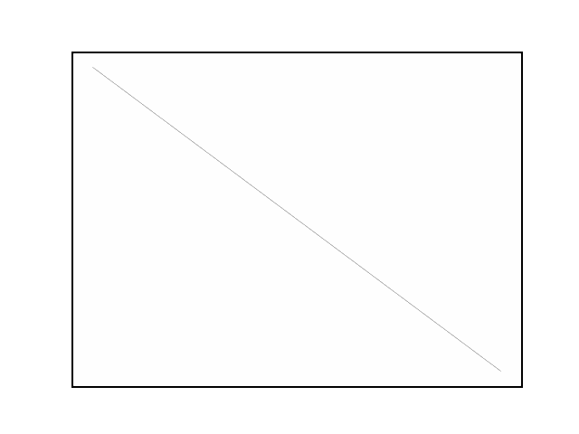

<table border="0">
  <td>
    
  </td>
  <td>
    <h1>Hi, I'm Remy Chaput :wave:</h1>
    PhD in Artificial Intelligence:robot:
  </td>
</table>

<h2>About me :man_technologist:</h2>

- I am a :hammer: software engineer, :memo: computer science researcher and :books: teacher from Lyon, France.
- My favourite languages are
  
  Python3 and 
  Java, although I use many languages.
- I mainly create projects that I find useful, but I also code for fun.

Read more on [rchaput.github.io](https://rchaput.github.io/)

<h2>My stack :computer:</h2>

<table border="0" style="vertical-align: top">
  <td style="vertical-align: top">
    <h3>Programming languages</h3>
     
     
     
     
     
     
     
     
     
     
     
     
  </td>

  <td style="vertical-align: top">
    <h3>Tools :wrench: </h3>
     
     
     
     
     
     
     
     
     
  </td>
</table>

<h2>GitHub stats :fire:</h2>

 

